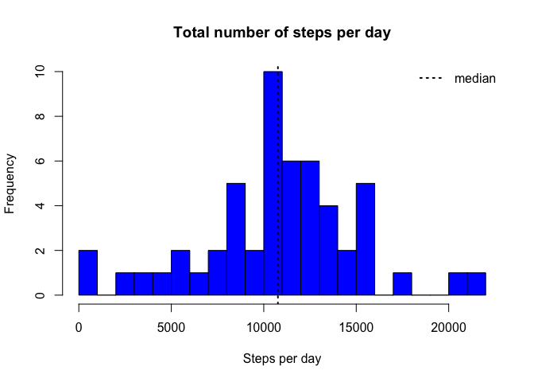
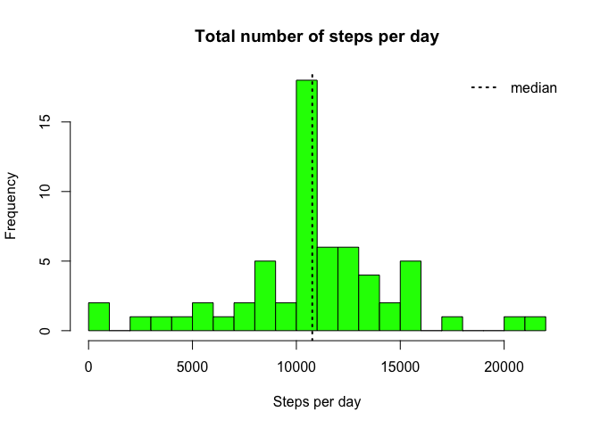
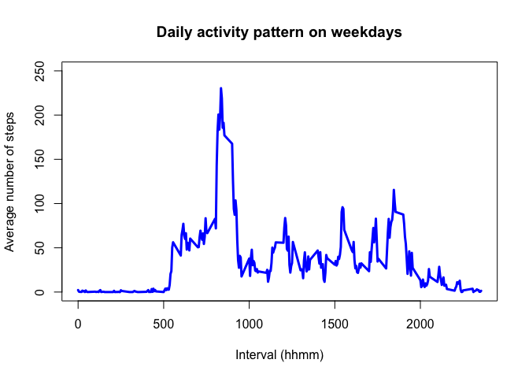
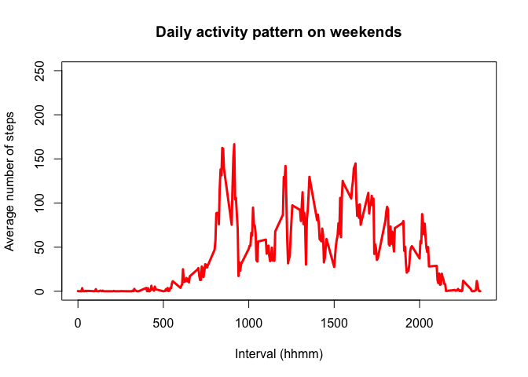

### By Robert J. Chen
### 08/10/2019

## Loading and preprocessing the data
Show codes that load the data (i.e. read.csv())
Process/transform the data ready for analysis.


```r
setwd("~/Dropbox/@Next/AI/JH_repro/HW1")
library(dplyr)
```

```
## 
## Attaching package: 'dplyr'
```

```
## The following objects are masked from 'package:stats':
## 
##     filter, lag
```

```
## The following objects are masked from 'package:base':
## 
##     intersect, setdiff, setequal, union
```

```r
library(lattice)
library(tidyr)
library(lubridate)
```

```
## 
## Attaching package: 'lubridate'
```

```
## The following object is masked from 'package:base':
## 
##     date
```

```r
if(!file.exists("activity.csv")){
  unzip("activity.zip")
}
activity<-read.csv("activity.csv" )
```

## What is the mean total number of steps taken per day?
Here we ignore the missing value in the dataset.
Make the histogram of the total number of steps taken each day. 
Calculate and report the mean and median total number of steps taken per day


```r
activity <- transform(activity, date = factor(date))
activity<-group_by(activity,date)
sum_steps_day <- summarise(activity, steps = sum(steps))
sum_steps_day <-na.omit(sum_steps_day)
```

Histogram of total steps taken per day


```r
hist(sum_steps_day$steps, main = "Total number of steps per day", 
    xlab = "Steps per day", ylab = "Frequency",col="blue", breaks=20)
abline(v=median(sum_steps_day$steps),lty=3, lwd=2, col="black")
legend(legend="median","topright",lty=3,lwd=2,bty = "n")
```

<!-- -->

#### Mean and median number of steps taken each day


```r
options(scipen=999)
mean_steps<-mean(sum_steps_day$steps, na.rm = TRUE)
print(paste("Mean:", mean_steps), sep = " ")
```

```
## [1] "Mean: 10766.1886792453"
```

```r
median_steps<-median(sum_steps_day$steps, na.rm = TRUE)
print(paste("Median:", median_steps), sep = " ")
```

```
## [1] "Median: 10765"
```

The mean of steps taken per day is 10766.
The median of taken steps is 10765.
The data contains NAs that are omitted for mean/median calculations and in the histogram.

## What is the average daily activity pattern?
Make a time series plot (i.e. type = "l") of the 5-minute interval (x-axis) and the average number of steps taken, averaged across all days (y-axis). Which 5-minute interval, on average across all the days in the dataset, contains the maximum number of steps?

Transform the activity data:


```r
activity <- transform(activity, interval = factor(interval))
activity<-group_by(activity,interval)
mean_steps_interval <- summarise(activity, steps = mean(steps,na.rm=TRUE))
```

Plot the averaged steps per interval:


```r
plot(levels(as.factor(mean_steps_interval$interval)), mean_steps_interval$steps, 
     type="l", col="blue", lwd=3, 
     main="Daily activity pattern", 
     xlab="Interval (hhmm)", ylab="Average number of steps")
```

<!-- -->

#### 5-minute interval with maximum number of steps (averaged across all days)


```r
max_steps<-mean_steps_interval[match(max(mean_steps_interval$steps),mean_steps_interval$steps),]
## The interval contains the maximum number of steps:
max_steps[1]
```

```
## # A tibble: 1 x 1
##   interval
##   <fct>   
## 1 835
```

```r
## The maximum number of steps:
max_steps[2]
```

```
## # A tibble: 1 x 1
##   steps
##   <dbl>
## 1  206.
```

The interval 835 contains the maximum number of steps which is 206 on average across all the days.

## Imputing missing values
Note that there are a number of days/intervals where there are missing values (coded as NA). The presence of missing days may introduce bias into some calculations or summaries of the data.

Calculate and report the total number of missing values in the dataset (i.e. the total number of rows with NAs)

#### Number of rows with NAs


```r
number_na<-sum(is.na(activity))
```

The total number of NAs in the monitoring data set is 2304. This is equivalent to the number of rows with NAs. Only column "steps" contains missing values. The relative amount of NAs compared to the whole data set is 13 %. 

In the following the calculated averages (the steps per 5-min interval) are used to fill the missing step values. A new dataset called "activity_noNAs" is created with the imputed missing value filled in. 


```r
setwd("~/Dropbox/@Next/AI/JH_repro/HW1")
activity_noNAs<-read.csv("activity.csv" )
class(activity_noNAs$interval)<-"numeric"
```

Create a new dataset that is equal to the original dataset but with the imputed missing data filled in.


```r
i<-1
for (i in 1:dim(activity_noNAs)[1]){
        if (is.na(activity_noNAs[i,1])){
                r<-match(activity_noNAs[i,3],mean_steps_interval$interval)
                activity_noNAs[i,1]<-mean_steps_interval[r,2]
                }
        i=i+1
}       
```

Make a histogram of the total number of steps taken each day and Calculate and report the mean and median total number of steps taken per day. 
Do these values differ from the estimates from the first part of the assignment? 
What is the impact of imputing missing data on the estimates of the total daily number of steps?


```r
sum_steps_day_noNAs <- tapply(activity_noNAs$steps, activity_noNAs$date, sum, na.rm = TRUE)
hist(sum_steps_day_noNAs, main = "Total number of steps per day", 
    xlab = "Steps per day", ylab = "Frequency",col="green", breaks=20)
abline(v=median(sum_steps_day_noNAs),lty=3, lwd=2, col="black")
legend(legend="median","topright",lty=3,lwd=2,bty = "n")
```

<!-- -->

#### Mean and median number of steps taken each day (no NAs) 


```r
mean_noNAs<-mean(sum_steps_day_noNAs)
print(paste("Mean:", mean_noNAs), sep = " ")
```

```
## [1] "Mean: 10766.1886792453"
```

```r
median_noNAs<-median(sum_steps_day_noNAs)
print(paste("Median:", median_noNAs), sep = " ")
```

```
## [1] "Median: 10766.1886792453"
```

The mean of steps taken per day is 10766.
The median of taken steps is 10766. 
Mean and median value did not change compared to the calculation above, where the NAs are omitted in the data set. This is because the dataset contains NAs for for complete days. Since these values are substituted by mean values nothing changes during mean and median calculation.

## Are there differences in activity patterns between weekdays and weekends?


```r
activity_noNAs<-mutate(activity_noNAs, date_day=wday(date))
activity_weekday<-subset(activity_noNAs,date_day>1 & date_day<7)
activity_weekday <- transform(activity_weekday, interval = factor(interval))
activity_weekday<-group_by(activity_weekday,interval)
mean_steps_interval_weekday <- summarise(activity_weekday, steps = mean(steps,na.rm=TRUE))
activity_weekend<-subset(activity_noNAs,date_day==1 | date_day==7)
activity_weekend <- transform(activity_weekend, interval = factor(interval))
activity_weekend<-group_by(activity_weekend,interval)
mean_steps_interval_weekend <- summarise(activity_weekend, steps = mean(steps,na.rm=TRUE))
plot(levels(as.factor(mean_steps_interval_weekday$interval)), mean_steps_interval_weekday$steps, 
     type="l", col="blue", lwd=3, ylim=c(0,250),
     main="Daily activity pattern on weekdays", 
     xlab="Interval (hhmm)", ylab="Average number of steps")
```

<!-- -->

```r
plot(levels(as.factor(mean_steps_interval_weekend$interval)), mean_steps_interval_weekend$steps, 
     type="l", col="red", lwd=3, ylim=c(0,250),
     main="Daily activity pattern on weekends",
     xlab="Interval (hhmm)", ylab="Average number of steps")
```

<!-- -->

The graphs show different daily activity patterns for weekdays and for the weekend. On weekdays most activities are in the morning (peaked around 8:35), whereas the activities on weekend are distributed more homogeneously throughout the day.
